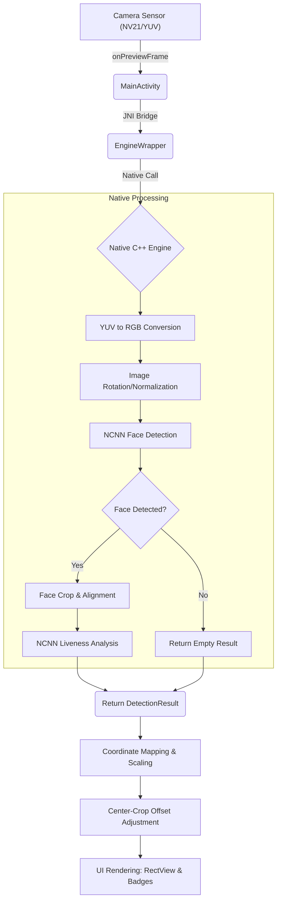

# Face Anti-Spoofing Processing Pipeline

**Created At**: 2026-05-04 11:40 AM (GMT+7)  
**Last Modified**: 2026-05-04 11:40 AM (GMT+7)

This document details the step-by-step data processing pipeline, explaining how raw camera frames are transformed into real-time liveness detections.

## 1. Frame Capture (Android Camera API)
The pipeline begins in `MainActivity.kt` using the legacy Camera1 API (chosen for high compatibility and low-latency YUV access).
- **Callback**: `onPreviewFrame(data: ByteArray, camera: Camera)`
- **Format**: NV21 (YUV420sp)
- **Resolution**: Dynamically selected via `getOptimalPreviewSize()` to match the screen's aspect ratio (typically capped at 1280x720 for performance).

## 2. The Engine Wrapper (Bridge)
The raw byte array is passed to `EngineWrapper.kt`, which serves as the JNI bridge to the C++ NCNN implementation.
- **Orientation**: The frame is tagged with its orientation (typically 90 or 270 degrees for portrait) so the engine can rotate the data correctly before inference.

## 3. Native Pre-processing (C++/OpenCV)
Inside the `engine` module:
- **Conversion**: YUV data is converted to RGB.
- **Normalization**: Pixel values are normalized to the range expected by the NCNN models.
- **Rotation**: The image is rotated to a standard upright orientation using OpenCV or custom matrix transformations.

## 4. Face Detection (NCNN)
The first AI stage uses a face detection model optimized via NCNN.
- **Input**: The full RGB frame.
- **Output**: A collection of `FaceBox` objects containing:
    - Coordinates (`x1, y1, x2, y2`)
    - Confidence score for the detection itself.

## 5. Liveness Analysis (Silent-Face-Anti-Spoofing)
For each detected face, the pipeline crops the face area and passes it to the liveness model.
- **Inference**: The model analyzes texture, depth cues, and reflection patterns that distinguish a real human face from a photo or screen (spoof).
- **Silent Detection**: Unlike "Active" liveness (which asks you to blink or turn your head), this "Silent" model performs detection on a single frame or short sequence without user interaction.
- **Score**: Returns a liveness confidence score (0.0 to 1.0).

## 6. Coordinate Mapping & Result UI
The results return to the Kotlin layer, where they must be mapped from the **Engine Resolution** (e.g., 640x480) to the **Screen Resolution**.
- **Scaling (`factorX/Y`)**: Adjusts the coordinates based on the ratio between the internal preview and the UI layout.
- **Center-Crop Offset (`offsetX/Y`)**: Crucial for modern screens. Since the camera preview is larger than the screen and "cropped" to fit, we subtract the hidden pixels so the bounding box aligns perfectly with the visible face.
- **Immersive Mapping**: With the app in Immersive Mode, the Y-coordinates are calculated relative to the absolute top of the physical screen, preventing "shifted" boxes.

## 7. Real-Time Rendering
- **RectView**: Draws the neon bounding box and confidence score.
- **DataBinding**: Automatically updates the result badges (Real/Fake) and icons based on whether the score exceeds the user-defined threshold.

---
*This pipeline is designed for high-performance (sub-50ms latency) on modern mobile ARM processors.*
